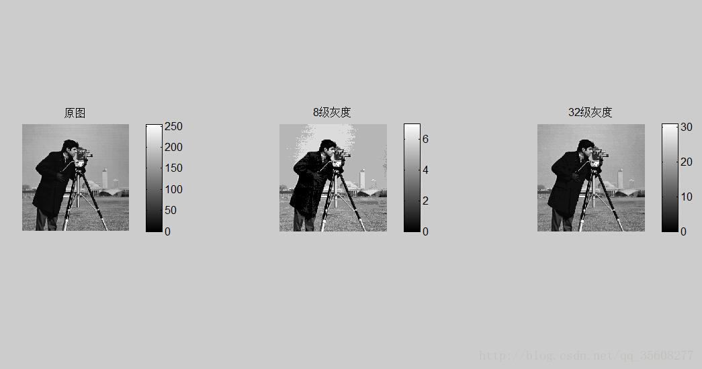
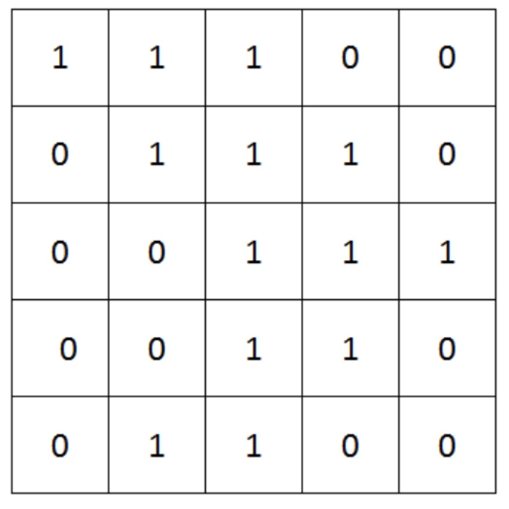
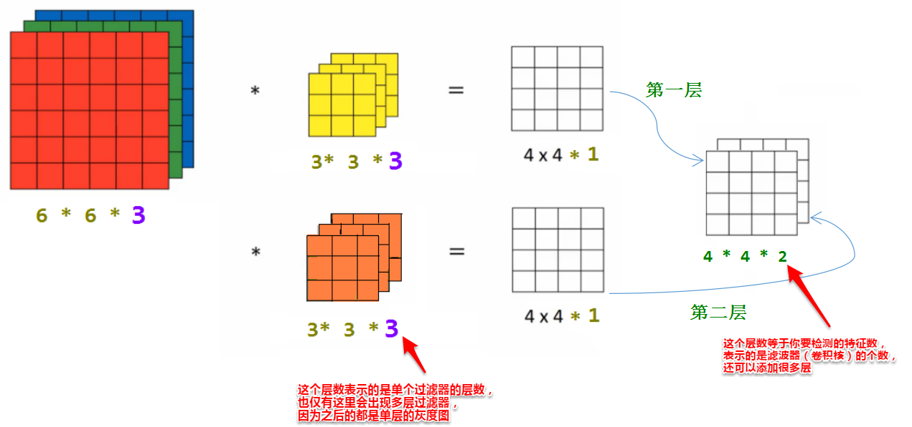
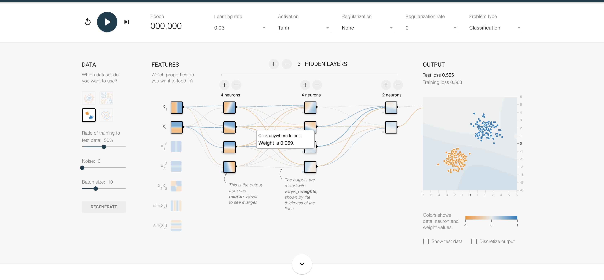
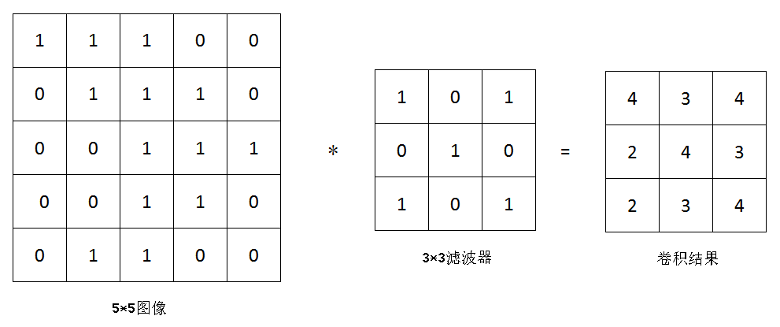
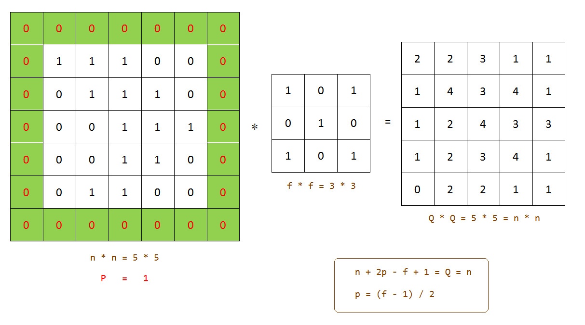
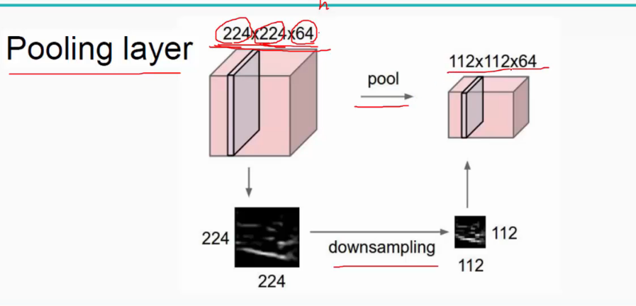
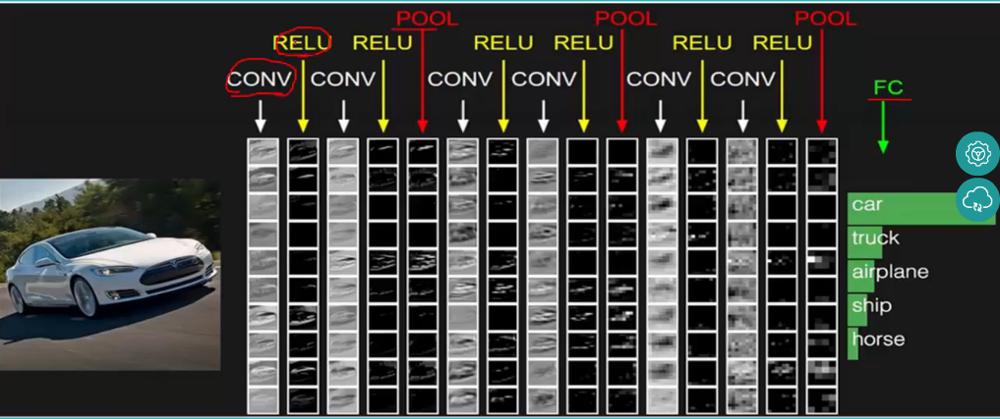
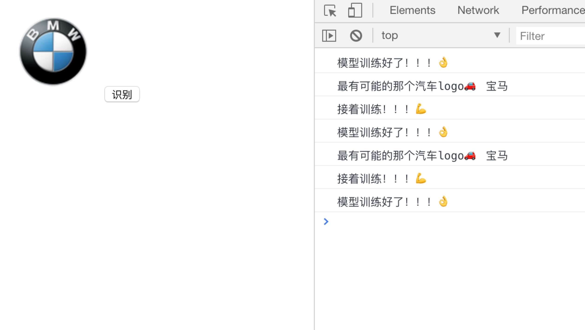
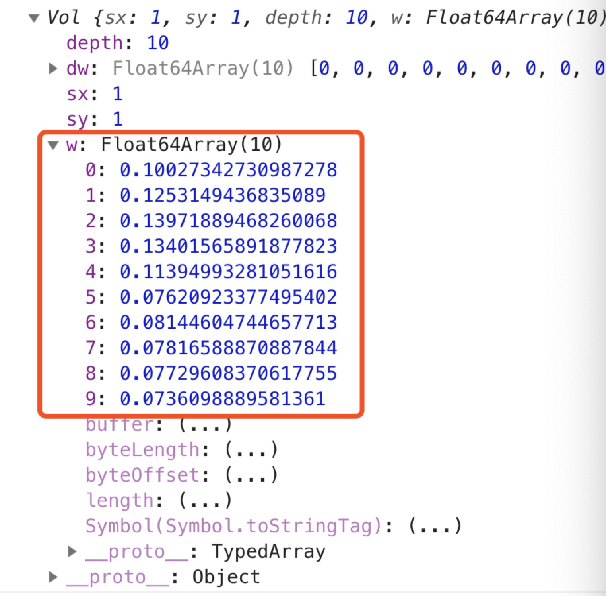

# 前端AI实战——告诉世界前端也能做AI

我想大多数人和我一样，第一次听见“人工智能”这个词的时候都会觉得是一个很高大上、遥不可及的概念，特别像我这样一个平凡的前端，和大部分人一样，都觉得人工智能其实离我们很遥远，我们对它的印象总是停留在各种各样神奇而又复杂的算法，这些仿佛都是那些技术专家或者海归博士才有能力去做的工作。我也曾一度以为自己和这个行业没有太多缘分，但自从Tensorflow发布了JS版本之后，这一领域又引起了我的注意。在python垄断的时代，发布JS工具库不就是意味着我们前端工程师也可以参与其中？

当我决定开始投身这片领域做一些自己感兴趣的事情的时候，却发现身边的人投来的都是鄙夷的目光，他们对前端的印象，还总是停留在上个年代那些只会写写页面脚本的切图仔，只有身处这片领域的我们才知道大前端时代早已发生了翻天覆地的变革。

今天，我就带领大家从原理开始，尽可能用最通俗易懂的方式，让JS的爱好者们快速上手人工智能。

具体项目可参照：https://github.com/jerryOnlyZRJ/image-regression 。

本文就单拿人工智能下的一块小领域——“图像识别”作一些简单介绍和实战指引，当然这些都只是这片大领域下的冰山一角，还有很多很多知识等着你去发掘。

## 1.CNN卷积神经网络原理剖析

如果我不讲解这部分内容，而是直接教你们怎么使用一个现成的库，那这篇文章就没什么价值了，看完之后给你们留下的也一定都会是“开局一张图，过程全靠编”的错觉。因此，要真正了解人工智能，就应该进入这个黑盒，里面的思想才是精华。

### 1.1.图像灰度级与灰度图

#### 1.1.1.基本概念

要做图像识别，我们肯定要先从图像下手，大家先理解一个概念——图像灰度级。

众所周知，我们的图片都是由许多像素点组成的，就好像一张100*100像素的图片，就表示它是由10000个像素点呈现的。但你可曾想过，这些像素点可以由一系列的数字表示嘛？

就先不拿彩色的图片吧，彩色太复杂了，我们就先拿一张黑白的图片为例，假设我们以黑色像素的深浅为基准，将白色到黑色的渐变过程分为不同的等级，这样，图片上每一个像素点都能用一个最为临近的等级数字表示出来：



如果我们用1表示白色，用0表示黑色，将图像二值化，最后以矢量（数字）的形式呈现出来，结果大概就是这样：（下图是一张5*5的二值化图像，没有具体表示含义，只作示例）



同理，如果是彩色的图像，那我们是不是可以把R、G、B三个维度的像素单独提取出来分别处理呢？这样，每一个维度不就可以单独视为一张灰度图。



#### 1.1.2.平滑图像与特征点

如果一张图像没有什么像素突变，比如一张全白的图片，如果以数字表示，自然都是0，那我们可以称这张图片的像素点是平滑的。再比如这张全白的图片上有一个黑点，自然，灰度图上就会有一个突兀的数值，我们就把它称作特征点，通常来说，图像的特征点有可能是噪声、边缘或者图片的实际特征。

### 1.2.神经网络与模型训练

tensorflow在发布了JS版本的工具库后，也同时制作了一个[Tensorflow游乐场](http://playground.tensorflow.org/)，打开之后，引入眼帘的网页中央这个东西便是神经网络：



从图中，我们可以看到神经网络有很多不同的层级，就是图中的Layers，每一层都是前一层经过滤波器计算后的结果，越多的层级以及越多的“神经元”经过一次计算过程计算出来的结果误差越小，同时，计算的时间也会增加。神经网络正是模仿了我们人类脑袋里的神经元经过了一系列计算然后学习事物的过程。这里推荐阮一峰的[《神经网络入门》](http://www.ruanyifeng.com/blog/2017/07/neural-network.html)这篇文章，能够帮助大家更加浅显地了解神经网络是什么。

在我们的卷积神经网络中，这些层级都有不同的名字：输入层、卷积层、池化层以及输出层。

* 输入层：我们输入的矢量化之后的图像
* 卷积层：经过滤波器卷积计算之后的图像
* 池化层：经过池化滤波器卷积计算之后的图像
* 输出层：输出数据

Features就是我们的算子，也称为滤波器，但是每种不同的滤波器对最后的输出结果都会有不同的影响，进过训练之后，机器会通过我们赋予的算法（比如激活函数等等）计算出哪些滤波器会对输出结果造成较大的误差，哪些滤波器对输出结果压根没有影响（原理很简单，第一次计算使用所有滤波器，第二次计算拿掉某一个滤波器，然后观察误差值（Training loss）就可以知道这个被拿掉的滤波器所起到的作用了），机器会为比较重要的滤波器赋予较高的权重，我们将这样一个过程称为“训练”。最终，我们将得到的整个带有权重的神经网络称为我们通过机器训练出的“模型”，我们可以拿着这个模型去让机器学习事物。

这就是机器学习中“训练模型”的过程，Tensorflow.js就是为我们提供的训练模型的工具库，当你真正掌握了模型训练的奥义之后，Tensorflow对你而言就像JQuery用起来一般简单。

大家看完这些介绍之后肯定还是一脸茫然，什么是滤波器？什么又是卷积计算？不着急，下一个版块的内容将会为大家揭开所有谜题。

### 1.3.卷积算法揭秘

#### 1.3.1.卷积算法

还记得我们在1.1.1里说到一张图片可以用矢量的形式表示每个像素点嘛？卷积计算就是在这基础上，使用某些算子对这些像素点进行处理，而这些算子，就是我们刚刚提到的滤波器（比如左边，就是一张经过二值化处理的5\*5的图片，中间的就是我们的滤波器）：



那计算的过程又是怎样的呢？卷积这东西听起来感觉很复杂，但实际上就是把我们的滤波器套到图像上，乘积求和，然后将图像上位于滤波器中心的值用计算结果替换，大概的效果就是下面这张动图这样：


对，所谓高大上的卷积就是这样一个过程，我们的滤波器每次计算之后就向右移动一个像素，所以我们可以称滤波器的步长为1，以此类推。不过我们发现，经过滤波器处理后的图像，好像“变小了”！原来是5\*5的图片这下变成了3\*3，这是卷积运算带来的必然副作用，如果不想让图片变小，我们可以为原图像加上一定像素且值均为0的边界（padding）去抵消副作用，就像下面这样：



#### 1.3.2.池化算法

其实在平时训练模型的过程中，我们输入的图像肯定不只有5\*5像素这么小，我们最经常见到的图片许多都是100\*100像素以上的，这样使用我们的机器去计算起来肯定是比较复杂的，因此，我们常常会使用池化算法进行特征提取或者图像平滑处理，池化的过程其实就是按照某种规律将图片等比缩小，过程就像下面这样：



而池化算法最常用的有两大类：取均值算法和取最大值算法，顾名思义，取均值算法就是取滤波器中的平均值作为结果，取最大值算法就是取滤波器中的最大值作为输出结果：


上图就是取最大值算法的处理过程，大家也能很直观的看出，在池化层中，滤波器的步长大都是等于滤波器自身大小的（比较方便控制缩放比例）。并且，取最大值算法肯定是很容易取到滤波器中的特征点（还记得特征点嘛？忘记的话快回去1.1.2看看哦～），所以我们可以讲取最大值算法的池化处理称为特征提取；同理，取均值算法因为把所有的像素点的灰度级都平均了，所以我们可以称之为平滑处理。

关于卷积神经网络的知识，可以具体参照这篇文章：[《卷积神经网络（1）卷积层和池化层学习》](https://www.cnblogs.com/zf-blog/p/6075286.html)。了解了这些知识之后，就可以开始我们的实战啦～

## 2.图像识别实战

说了那么多理论，也不比实操来得有感觉。在大家了解了卷积神经网络的基本原理之后，就可以使用我们的工具库来帮助我们完成相关工作，这里我推荐[ConvNetJS](https://github.com/karpathy/convnetjs)。这款工具库的本质就是我们在1.2中提到的别人训练好的模型，我们只需要拿来“学习”即可。

### 2.1.使用ConvNetJS

我们可以看到在ConvNetJS的README里有这样一段官方demo，具体的含义我已经用注释在代码里标注：

```js
// 定义一个神经网络
var layer_defs = [];
// 输入层：即是32*32*3的图像
layer_defs.push({type:'input', out_sx:32, out_sy:32, out_depth:3}); 
// 卷积层 
// filter：用16个5*5的滤波器去卷积
// stride：卷积步长为1
// padding：填充宽度为2（为保证输出的图像大小不会发生变化）
// activation：激活函数为relu（还有Tanh、Sigmoid等等函数，功能不同）
layer_defs.push({type:'conv', sx:5, filters:16, stride:1, pad:2, activation:'relu'});
// 池化层
// 池化滤波器的大小为2*2
// stride：步长为2
// 在这里我们无法看出这个框架池化是使用的Avy Pooling还是Max Pooling算法，先视为后者
layer_defs.push({type:'pool', sx:2, stride:2});
// 反复卷积和池化减小模型误差
layer_defs.push({type:'conv', sx:5, filters:20, stride:1, pad:2, activation:'relu'});
layer_defs.push({type:'pool', sx:2, stride:2});
layer_defs.push({type:'conv', sx:5, filters:20, stride:1, pad:2, activation:'relu'});
layer_defs.push({type:'pool', sx:2, stride:2});
// 输出层
// 分类器：输出10中不同的类别
layer_defs.push({type:'softmax', num_classes:10});

// 实例化一个神经网络
net = new convnetjs.Net();
net.makeLayers(layer_defs);

// 模型训练
const trainer = new convnetjs.SGDTrainer(net, { learning_rate: 0.01, momentum: 0.9, batch_size: 5, l2_decay: 0.0 });
trainer.train(imgVol, classIndex);

// 使用训练好的模型进行图像识别
var x = convnetjs.img_to_vol(document.getElementById('some_image'))
var output_probabilities_vol = net.forward(x)
```

如果想要更形象点，上述过程可以用这样一幅图表示：



中间的“卷积-池化-卷积-池化……“就是我们定义并训练的神经网络，我们输入矢量化处理后的图像后，先进行卷积运算，不同的滤波器得到了不同的结果，官方demo里是使用了16个不同的滤波器（PS：这里给大家留一个思考的问题，一个3\*3的二值化滤波器，能写出多少种可能？），自然能卷积出16种不同的结果，在拿着这些结果池化处理，不断重复这个过程，最终得出图像识别结果：



### 2.2.实战项目解析

来，我们一起详细梳理一下使用ConvNetJS这个工具库完成整个图像识别的具体流程，

（PS：项目代码具体参照：https://github.com/jerryOnlyZRJ/image-regression ）

首先，我们必须先有数据供我们的模型去学习，至少你该这个模型知道啥是啥对吧，在项目里的 `net` 文件夹里的 `car.js` 文件，存放的就是我们的学习数据，如果你们感兴趣可以打开看看，里面的数据就是告诉机器什么样的车标对应的是车的什么品牌。

在我们的项目里，是通过这样一段代码完成机器学习的：

```js
const trainer = new convnetjs.SGDTrainer(net, { learning_rate: 0.01, momentum: 0.9, batch_size: 5, l2_decay: 0.0 });
let imageList = [];
const loadData = i => {
    return function () {
        return new Promise(function (resolve, reject) {
    		let image = new Image();
		    image.crossOrigin = "anonymous";
 		    image.src = carList[i].url;
		    image.onload = function () {
        		let vol = convnetjs.img_to_vol(image);
                // 逐张训练图片
        		trainer.train(vol, i);
       		 	resolve();
    		};
   		  	image.onerror = reject;
		})
    }
}
// 遍历图片资源
for (let j = 0; j < carList.length; j++) {
    imageList.push(loadData(j));
}
var testBtn = document.getElementById("test")
function training(){
    testBtn.disabled = true
    return new Promise((resolve, reject) => {
        Promise.all(imageList.map(imageContainer => imageContainer())).then(() => {
    		console.log("模型训练好了！！！👌")
    		testBtn.disabled = false
    		resolve()
		})
    })
}
```

我们试着去打印一下图像识别的输出结果，得到的是这样一个东西：



从识别结果中我们可以看到，我们得到的是一个数组，这就是经过分类器分类的10个不同类别，对应的自然是我们的车的品牌，值就是每个类别对应的概率。所以，我们只要拿到概率的最大值，就是预测得出的最倾向的结果。

## 3.结语

随着JS引擎的计算能力不断增强，人工智能领域的不断发展，可以预见的是，在不久的将来，肯定能有一些简单的算法可以被移植到用户前端执行，这样既能减少请求，又能分担后端压力。这一切并不是无稽之谈，为什么tensorflow.js会应运而生，正是因为JS的社区在不断壮大，JS这款便捷的语言也在得到更为普遍的使用。所以，请对你所从事的这份前端事业，有足够的信心！

还是那句老话：

**技术从来不会受限于语言，受限你的，永远只是思想。**

我并不是什么算法工程师，我也不是CS专业出来的科班生，我只是一枚普普通通的前端，和绝大多数人一样，没有多深厚的基础，但我愿意去学，我享受克服困难的过程，而那份对人工智能的执着，只是来源于那份不满足于现状的倔性和对这片领域一成不变的初心。

如果您觉得这篇文章对您有帮助，还请麻烦您为文章提供的示例demo项目点个star；如果您对我的其他项目感兴趣，也欢迎follow哦～

## 4.鸣谢

本文项目资源大部分来自[京程一灯](https://yd.ke.qq.com)，感谢[京程一灯](https://yd.ke.qq.com/)袁志佳老师对本文以及我个人提供的支持和帮助，如果你也在前端前进路上感到迷茫，[京程一灯](https://yd.ke.qq.com/)也许是你不错的选择。